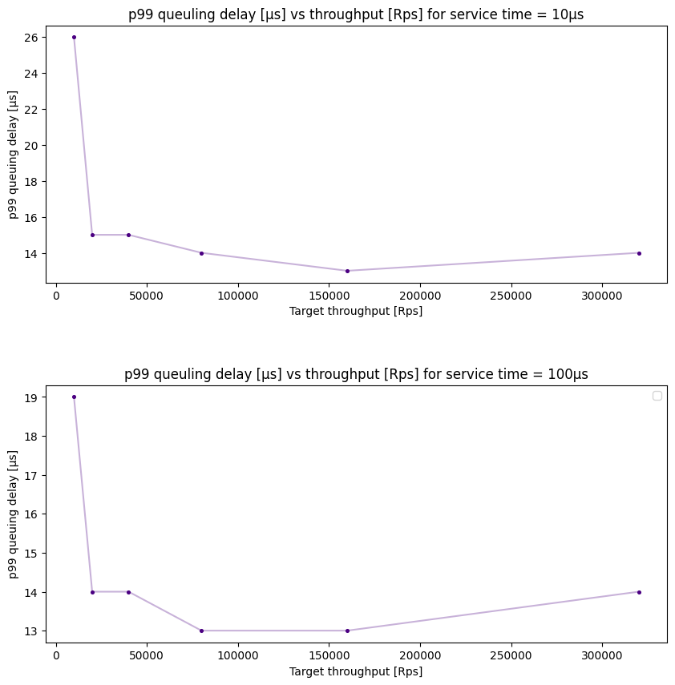
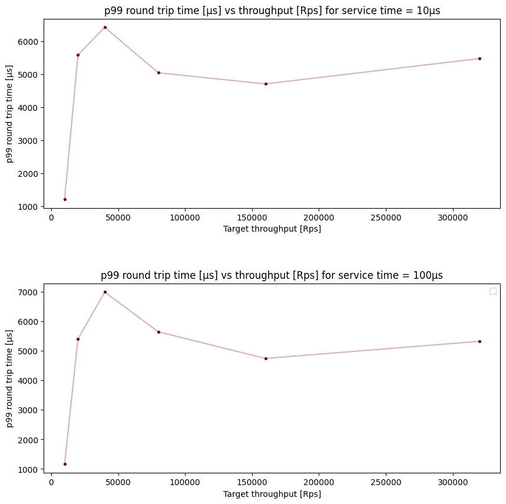
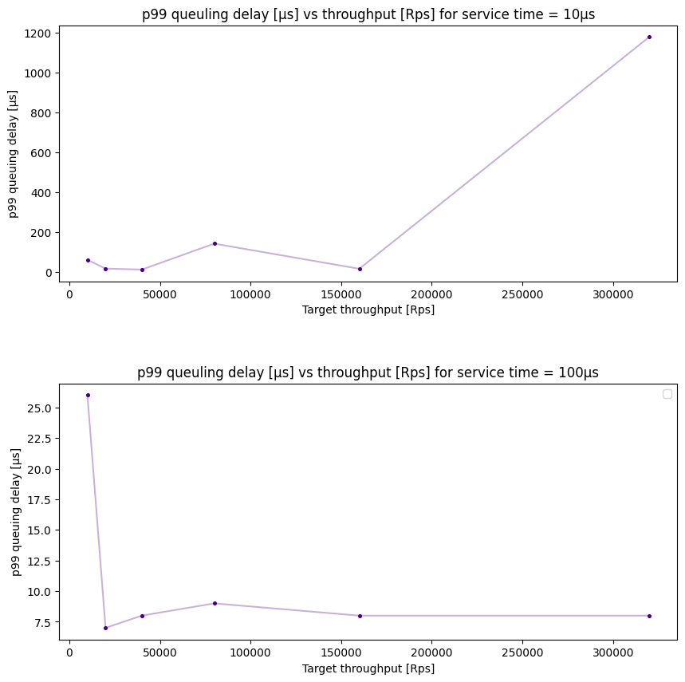
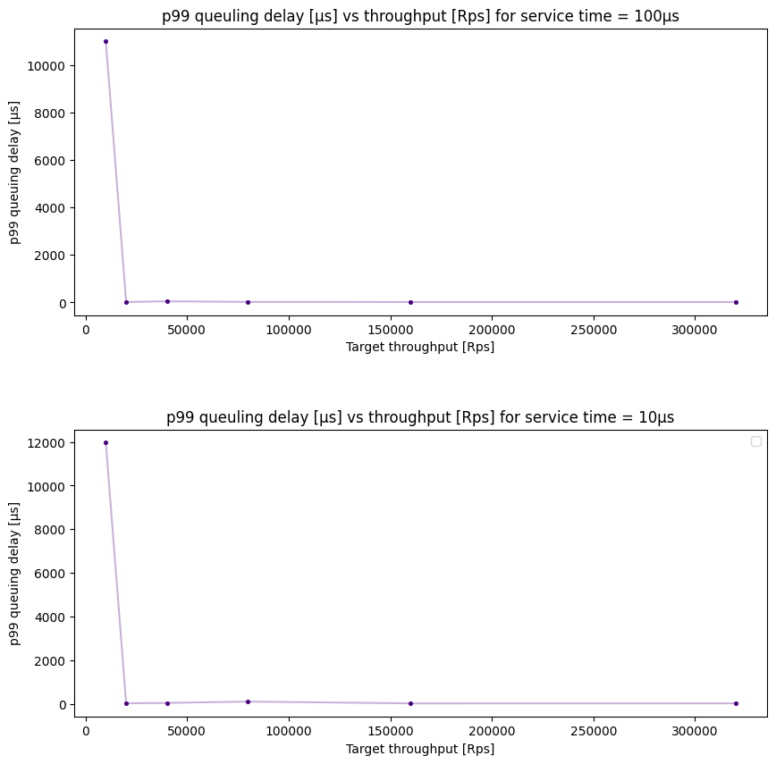
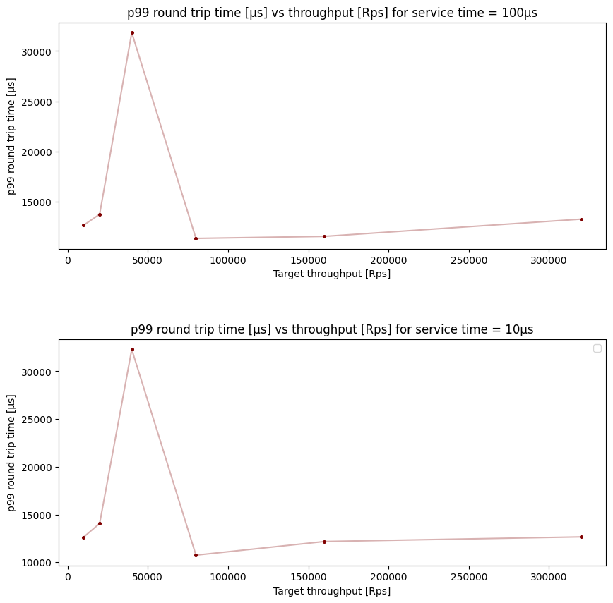

# Lab 1 Report - Ludovic Mermod

## Table of contents

- [Lab 1 Report - Ludovic Mermod](#lab-1-report---ludovic-mermod)
  - [Table of contents](#table-of-contents)
  - [Round Robin Scheduling](#round-robin-scheduling)
    - [Implementation](#implementation)
    - [Results](#results)
  - [Round Robin Core Separated Scheduling](#round-robin-core-separated-scheduling)
    - [Implementation](#implementation-1)
    - [Results](#results-1)
  - [Dynamic core allocation](#dynamic-core-allocation)
    - [Implementation](#implementation-2)
    - [Results](#results-2)

## Round Robin Scheduling

### Implementation

Round-robin scheduling is achieved by maintaining a counter increased each time a packet is redirected. When a packet arrives, we fetch the counter value and increment it, then use its value modulo the number of CPU to choose a CPU to redirect to. If the CPU is unavailable, we abort and drop the packet.

### Results

While round-robin is simple and elegant, it does not account for any parameters. The more packets are coming in, the longer the queuing delay is, since a new packet should wait for the CPU it was assigned to to complete all its current packets. Ergo, the queing delay increases with the traffic, as shown by the graph.

## Round Robin Core Separated Scheduling

### Implementation

The goal of core separated round-robin scheduling is to sort packets between short and long requests, to quickly respond to fast requests. It is similar to round-robin, except that we maintain two iterators over two sets of cores, one handling small and the other large packets.

### Results

Since DCA takes into account the size of the packets, small payloads are always handled quickly, while large ones accumulate. This is put into evidence by the queuing delay being increasingly big for large throughputs.

## Dynamic core allocation

### Implementation

Dynamic core allocation allows the server to use a number of core dependent on the workload that the requests require. I.e. when there are a lots of incoming requests, we want to allocate more resources to answer those quickly, but reducing them when there is low traffic.

To achieve this, the user-space program dynamically updates the count of CPUs used for redirection in a shared map, then used by the kernel-space program.

### Results

When DCA is enabled, the resources are dynamically allocated, so the queuing delay and round trip time are quite constant. The initial peak is probably due to the time that the program needed to find the correct initial core count, before settling down and having a tolerable average queuing delay.
